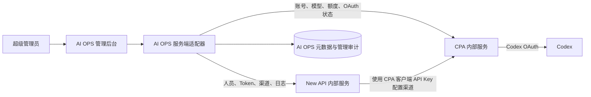

<!--
文档类型：产品需求文档（PRD）
版本：V2.3 统一平台需求草案
状态：核心方向已确认，技术字段待实现/验证
说明：本版以“单一超级管理员控制台 + Docker 内部编排 + New API/CPA 凭据链路 + Codex 上游”为唯一目标。AI OPS 是唯一管理入口，CPA 和 New API 由 Compose 一起启动并由 AI OPS 服务端统一接管；管理员不需要进入它们的管理网站。
-->

# AI OPS 管理平台需求文档

::: warning 本版定位
AI OPS 当前只给一个超级管理员使用，不建设员工客户端、员工登录和员工自助端。员工最终分发的 Key 是由 New API 创建和管理的 New API 用户 Token/API Key；Key 的人员绑定、单模型限制、额度和有效期以 New API 为最终来源。CPA 的 Codex OAuth 账号是上游认证凭据，CPA 客户端 API Key 只由 New API 用来配置 CPA 渠道，绝不能作为员工 Key 分发。
:::

| 项目 | 内容 |
| --- | --- |
| 产品名称 | AI OPS 管理平台 |
| 文档版本 | V2.3 草案 |
| 唯一控制角色 | 超级管理员 |
| 固定运行链路 | AI OPS → New API（渠道/令牌）→ CPA → Codex |
| 部署方式 | Docker Compose 统一启动 |
| 当前使用入口 | 只有 AI OPS 管理后台；CPA/New API 管理页不作为业务入口 |
| CPA 渠道凭据 | CPA 配置的客户端 API Key，由 New API 用于创建/配置渠道，不直接作为员工 Key 分发 |
| 员工接入 Key 来源 | New API 用户 Token/API Key，由 AI OPS 调用 New API 创建、查询、停用和分发 |
| 模型/账号额度来源 | CPA 的真实 Codex 账号池和运行状态 |

## 1. 产品定位

AI OPS 是一个只面向超级管理员的管理控制台，不是员工客户端，也不新增一套 AI 网关。

管理员在 AI OPS 中：

1. 导入或维护人员资料；
2. 从 CPA 当前可用模型中选择模型；
3. 调用 New API 为一名人员创建一个与模型绑定的员工 Key；
4. 保证一个对外分发的 Key 只绑定一个人员和一个模型；
5. 将创建或分配结果交给管理员后续分发；
6. 按 Key 查看调用日志和对话审计信息；
7. 在人员停用时，停用该人员的全部关联凭据。

当前版本不实现员工在 AI OPS 中登录、调用、查看 Key 或查看自己的用量，也不开发员工客户端。未来外部客户端可以使用管理员分发的最终接入 Key；为满足真实正文审计，请求必须经过受控的正文采集入口，优先扩展 New API 请求处理，也可以保留精简的透明审计代理或扩展 CPA。采集层不能重新定义 Key、模型或额度规则。

## 2. 固定架构

### 2.0 当前已核实的凭据拓扑

- CPA Codex OAuth 认证账号：保存在 CPA `auths` 中，用于访问 Codex 上游。
- CPA 客户端 API Key：由 CPA 配置并由 New API 渠道使用；它不是 OAuth 文件，也不是员工接入 Key。
- New API 渠道：保存上游地址和 CPA 客户端 API Key，负责把请求转发到 CPA。
- New API 用户 Token：当前部署中存在独立的 Token 对象，带有 `user_id`、状态、模型限制、额度和有效期字段；本项目将其作为最终分发给员工的 API Key。

因此，项目只维护一套对外可调用的员工 Key：New API Token/API Key。AI OPS 只保存外部 ID、掩码和人员映射；CPA 渠道凭据始终是内部上游配置，不进入员工分发流程。

### 2.0.1 统一接管原则

1. 根目录 Docker Compose 一次启动 AI OPS、New API 和 CPA；管理员不需要分别启动、登录或配置这两个上游网站。
2. 浏览器只访问 AI OPS 前端和 AI OPS 服务端接口；前端不直连 New API/CPA 管理接口，不嵌入其管理页面，也不把上游后台链接作为日常操作入口。
3. AI OPS 服务端通过 New API/CPA 适配器完成读取、写入、健康检查、版本识别和幂等同步；前端不得携带 New API 管理令牌、CPA 管理 Key 或 OAuth 凭据。
4. 启动后由 AI OPS 自动检查依赖状态、认证状态、模型目录、CPA 渠道和关键接口版本；发现可安全修复的配置漂移时执行幂等同步，否则显示明确的 `starting`、`ready`、`degraded`、`auth_required` 或 `sync_failed` 状态。
5. New API 和 CPA 的管理端口只作为 Compose 内部服务或本机受限端口存在，不作为管理员工作流的一部分；所有管理读写结果都在 AI OPS 页面展示。
6. Codex OAuth 若必须跳转官方授权页，只能由 AI OPS 发起授权流程并回到 AI OPS；授权完成后不要求管理员打开 CPA 管理面板。

### 2.1 AI OPS 负责

- 超级管理员登录、会话和管理审计。
- 作为唯一管理入口，聚合 New API、CPA 和 Docker 依赖状态；不把上游管理网站暴露为业务导航。
- 人员导入、编辑、停用和字段扩展。
- 人员与最终接入 Key 的归属映射。
- 通过服务端适配器调用 New API/CPA 的创建、查询、修改、停用和删除接口；浏览器不直接调用上游管理接口。
- 强制一个对外分发的 Key 只能绑定一个人员和一个模型。
- 确保 New API 渠道使用 CPA 客户端 API Key，而不是把该 Key 分发给员工。
- 从 CPA 读取真实 Codex 认证账号、模型目录、额度窗口和账号状态。
- 以 Key 为主要维度查看 New API 调用日志和对话审计元数据。
- 在 AI OPS 内发起 CPA OAuth、刷新状态和渠道同步，并显示失败原因和恢复动作。
- 展示 AI OPS、New API、CPA 和 Docker 的健康状态。

AI OPS 不保存 CPA OAuth 原文、刷新令牌、完整 New API 管理凭据或员工 Key 明文。

### 2.2 New API 负责

- 管理渠道，生成、存储、校验和失效最终分发给员工的 API Key/Token。
- 保存并执行 Key 的人员归属映射所需的 Token 标识。
- 执行 Key 的单模型限制和启用/停用状态。
- 按当前策略配置 Key 为无限额度、永不过期。
- 接收请求、调用 CPA 渠道并记录请求日志。
- 返回 Key、请求、模型和状态的真实管理数据。
- 接受 AI OPS 服务端的幂等管理调用；管理员不需要进入 New API 管理页面。

New API 是渠道和员工 Token/API Key 对象的事实源；CPA 是 OAuth、客户端 API Key、模型能力和上游额度的事实源。AI OPS 不在本地生成第二套可调用 Key，也不在本地扣减上游额度。

### 2.3 CPA 负责

- Codex OAuth 登录和认证文件管理。
- Codex 账号池、刷新、调度和上游协议适配。
- 提供客户端 API Key，供 New API 创建/配置 CPA 渠道；该 Key 不应进入员工分发流程。
- CPA 实际支持的模型目录。
- Codex 账号的真实额度窗口、剩余量、重置时间和可用状态（当前部署通过 CPA 管理 `api-call` 适配查询 Codex usage；以当前 CPA 版本实际提供的管理能力为准）。
- 向 New API 提供可用的 Codex 渠道。
- 接受 AI OPS 服务端通过适配器发起的账号、模型、额度和 OAuth 状态查询；管理员不需要进入 CPA 管理页面。

CPA 认证文件是上游 Codex 账号凭据，不是 AI OPS 要分发给人员的 New API Key。AI OPS 只能读取 CPA 返回的摘要和运行状态，不能解析或展示 OAuth 原文。

## 3. 三层数据边界

| 数据对象 | 最终事实源 | AI OPS 保存方式 |
| --- | --- | --- |
| 人员资料 | New API 用户；AI OPS 负责导入和同步 | AI OPS 保存 New API 用户 ID、必要展示字段和同步状态 |
| 人员状态 | New API 用户状态 | AI OPS 发起修改；停用后触发关联 Key 停用 |
| CPA 渠道 API Key | CPA 配置；New API 渠道引用 | 只在服务端使用，绝不作为员工 Key 分发 |
| New API 用户 Token/API Key | New API | 只保存 Token ID、掩码、人员映射和同步状态；完整 Key 仅一次性展示 |
| 员工最终接入 Key | New API 用户 Token/API Key | 与 New API Token 对象一致，不另建 CPA 员工 Key |
| Key 明文 | 对应上游创建/分配响应 | 只向超级管理员短暂显示，不写日志和数据库 |
| Key 绑定人员 | AI OPS 映射 + 对应外部 ID | 本地关系表；一个人员可以有多个 Key |
| Key 绑定模型 | 最终 Key 所在事实源 | 一个 Key 只能有一个模型；一个模型可以被多个 Key 使用 |
| Key 分组 | 不使用 | AI OPS 不展示、不创建、不维护分组 |
| Key 有效期 | New API Token/API Key | 默认永不过期；实际状态以 New API 返回为准 |
| Key 额度限制 | New API Token/API Key | 默认无限额度；不维护本地额度账本 |
| Codex 账号认证 | CPA | 只保留 CPA 内部文件，AI OPS 仅保存摘要 |
| Codex 模型目录 | CPA | 只读实时数据；不创建本地别名 |
| Codex 账号额度 | CPA 运行状态 | 只读展示和健康判断，不伪造为 Key 额度 |
| API 调用日志 | New API；必要时关联 CPA usage | 按 Key 查询和展示，并关联真实正文审计记录 |
| Prompt/回复正文 | 请求链路内容采集层 | 加密保存并与 New API request_id、token_id 关联，不进入普通日志 |
| 管理员操作审计 | AI OPS | 本地追加记录，不替代上游请求日志 |

重要原则：

- CPA 的账号额度、CPA 渠道 API Key 和员工接入 Key 是三个不同维度。CPA 额度属于 Codex 上游账号/账号池，可能被多个 Key 共享，不能默认等同于某一个 Key 的独立额度。
- 当前部署已验证可以通过 CPA 管理 `api-call` 读取 Codex usage 和 reset credits；该能力是“管理接口代理上游查询”，不是 `auth-files` 固定字段。适配器必须保存字段版本、查询时间和失败原因。
- 如果当前 CPA 版本或上游接口没有稳定额度字段，AI OPS 必须显示“额度暂不可读”，不能从认证文件中的 OAuth 字段推算额度。
- 同一个字段如果在 AI OPS 只有缓存，页面必须标明缓存时间和同步状态；不能用演示数据冒充真实数据。

## 4. 人员模型

### 4.1 最小字段

人员导入后必须同步创建或更新 New API 用户。AI OPS 人员页只保留以下最小展示字段：

| 字段 | 含义 | 来源/规则 |
| --- | --- | --- |
| `id` | 人员/用户 ID | 使用 New API 用户 ID；AI OPS 另存内部映射，不改变上游 ID |
| `username` | 用户名/姓名 | 导入值写入 New API 用户名或显示名称，具体字段按部署版本合约映射 |
| `status` | 人员状态 | 以 New API 用户状态为准；AI OPS 发起停用/启用 |
| `created_at` | 创建时间 | New API 用户创建时间 |
| `last_used_at` | 最后使用时间 | 由该人员关联最终接入 Key 的最新真实请求日志计算，不使用登录时间代替 |
| `management` | 管理操作 | 页面操作列，不是数据库字段；至少包含编辑、查看 Key、查看审计、停用 |

如果 New API 创建用户接口要求密码，AI OPS 服务端生成随机初始密码并只提交给 New API；不向人员展示、不作为 AI OPS 登录凭据、不写入 AI OPS 日志。

### 4.2 人员与 Key 关系

- 一个人员可以拥有多个 Key。
- 一个模型可以绑定多个 Key。
- 一个 Key 必须且只能绑定一个人员。
- 一个 Key 必须且只能绑定一个模型。
- 人员停用时，AI OPS 必须查询并调用 New API 停用该人员的全部关联员工 Key；不得只更新 AI OPS 本地状态。
- 停用操作只有在实际事实源成功后才能在 AI OPS 标记为完成；部分失败必须显示失败 Key 清单。

## 5. 模型来源与选择

模型不是 AI OPS 本地写死的业务别名，业务来源是 CPA 当前可用的 Codex 模型。

模型选择流程：

1. AI OPS 从 CPA 管理接口或 CPA OpenAI 兼容模型接口读取真实模型 ID；
2. 过滤出当前 New API 已配置、可通过 CPA 渠道转发的模型；
3. 在创建 Key 时只允许选择一个真实模型 ID；
4. 将该模型 ID 写入 New API Token 的 `model_limits` 单模型限制；
5. 不创建模型别名、备用模型、供应商切换或本地模拟模型。

如果 CPA 只接入 Codex，页面只展示当前 CPA 实际返回的 Codex 模型；具体模型名称和数量随认证账号、CPA 版本和上游能力变化，不在需求文档中写死。

## 6. Key 策略

### 6.1 创建规则

管理员创建 Key 时必须选择：

- 一个人员；
- 一个 CPA 真实模型。

本版不选择分组。New API 如果因版本或渠道配置必须存在默认分组，由 New API 使用其默认配置；AI OPS 不向管理员暴露或维护分组字段。

Key 创建策略（New API Token/API Key）：

- `model_limits_enabled` = `true`；
- `model_limits` 只能有一个模型 ID；
- `unlimited_quota` = `true`；
- 有效期设置为永不过期对应的 New API 值；
- 跨分组重试和 IP 白名单不作为初版业务字段；
- Key 名称应包含人员可识别信息，但不得包含完整 Key 或 OAuth 内容。

### 6.2 Key 生命周期

必须支持：

- 创建；
- 查询和掩码展示；
- 修改绑定模型（必要时重建或轮换）；
- 停用；
- 删除；
- 重新生成；
- 人员停用联动停用；
- 与 New API 的实际状态同步；New API 渠道状态和员工 Token 状态分别记录。

完整 Key 只在创建或重新生成成功后向超级管理员展示一次。普通列表、日志和错误信息只允许使用掩码或外部 ID；正文导出必须经过超级管理员权限和导出审计。

## 7. CPA 额度与健康信息

AI OPS 需要展示 CPA 返回的真实账号状态，包括当前版本实际支持的：

- Codex 认证账号标识和状态；
- 可用模型；
- 5 小时/周周期等额度窗口；
- 剩余比例或剩余量；
- 预计重置时间；
- 最近错误或暂不可用原因。

当前部署探测结果：`GET /v0/management/auth-files` 可以返回 `auth_index`、账号状态、计划信息和请求统计，但不直接返回完整额度窗口；CPA 管理页面通过 `POST /v0/management/api-call` 代理 Codex usage 与 reset-credits 查询，当前可取得 `rate_limit.primary_window.used_percent`、`reset_at`、`reset_after_seconds`、`credits`、`model_usage` 等字段。AI OPS 应把这条链路封装为 CPA 版本适配器，不把上游内部接口字段硬编码到页面，也不把 OAuth 文件当作额度来源。

这些数据用于管理员了解 CPA 账号池是否可用，不转换成 AI OPS 本地额度，也不按人员虚构分摊。

如果需要以后实现“每个人单独额度”，必须另行定义 CPA 账号分配、Key 请求计量和并发竞争规则；当前版本不实现。

## 8. 按 Key 进行调用日志与对话审计

对话审计的第一主键是对外分发 Key 的内部映射 ID；同时保存 New API `token_id` 和可用的 CPA 渠道 ID，而不是人员、用途或分组。

至少支持：

- 按 Key 筛选；
- 从 Key 反查绑定人员和模型；
- 查看请求时间、模型、请求状态、请求 ID、耗时、Token 用量等元数据；
- 查看同一 Key 的调用时间线；
- 从审计记录跳转到对应 New API 日志；
- 记录管理员查看审计的操作。

必须查看真实 Prompt 和回复正文。New API 当前日志接口/日志表主要提供 token、模型、时间、用量、状态等元数据，不足以直接恢复完整正文；因此必须在真实请求链路增加正文采集能力，不能用本地合成数据代替。

正文审计要求：

- 以内部 `key_id`、New API `token_id`、可用的 CPA 渠道 ID 和 `request_id` 建立唯一关联；
- 捕获真实入站 Prompt、上下文、工具调用内容和真实出站回复，包括流式响应拼接结果；
- 正文与元数据分离保存，服务端加密存储，普通日志只记录摘要、长度和哈希；
- 自动脱敏 Authorization Header、API Key、OAuth、刷新令牌和其他凭据，但不把整段对话替换成演示文本；
- 只有超级管理员可以查看正文；每次查看记录时间、Key、request_id 和操作原因；
- 正文硬性保留上限为 30 天；本版默认按 30 天保存，允许以后只缩短不能超过上限，到期自动删除并留下删除证明；
- 允许超级管理员复制和导出真实正文，但每次复制/导出必须记录管理员、Key、request_id、时间、原因和导出范围；导出内容不得包含 Authorization Header、完整 Key、OAuth 或刷新令牌；
- 请求失败、流式中断和工具调用也必须保留真实状态，不能只保存成功样例。

实现上优先扩展 New API 请求处理，在鉴权得到 New API Token 身份后采集入站和出站正文；如果 New API 无法改造，再扩展 CPA 或保留受控透明审计代理。仅调用 New API 的普通 `/api/log` 接口无法满足正文审计。

## 9. 管理员权限

AI OPS 只保留超级管理员：

- 管理人员；
- 创建和管理全部 Key；
- 查看 CPA 账号、模型和额度状态；
- 查看按 Key 的日志/审计；
- 管理 Codex OAuth；
- 查看系统健康和同步错误。

不保留普通管理员、部门负责人、财务角色、员工登录、员工自助和多级审批。

## 10. 核心业务流程

1. Docker Compose 一次启动 AI OPS、New API 和 CPA；AI OPS 自动执行健康检查、版本探测和依赖同步。
2. 超级管理员只登录 AI OPS；不打开 New API 或 CPA 管理网站。
3. 管理员沿用当前 CPA Codex 登录认证方案；OAuth 流程由 AI OPS 发起和回收，本版不要求进入 CPA 管理面板。
4. AI OPS 服务端通过适配器读取 CPA 配置，自动校验或创建 New API 的 CPA 渠道；管理员不手动复制 CPA Key 到 New API 页面。
5. 管理员导入人员资料，AI OPS 调用 New API 创建/更新用户，并保存用户 ID 映射。
6. AI OPS 读取 CPA 的真实模型和账号额度状态；不可读时明确显示错误或未知。
7. 管理员选择一个人员和一个模型，不选择分组。
8. AI OPS 调用 New API 创建一个无限额度、永不过期且只允许该模型的员工 API Key/Token；CPA 客户端 API Key 只用于内部渠道。
9. AI OPS 保存 New API `token_id` 与人员映射，并向管理员一次性显示完整员工 Key。
10. 管理员在平台外部按自己的方式分发 Key；当前版本不建设员工客户端或通知渠道。
11. 人员停用时，AI OPS 查询其全部 New API Token 并逐个停用，成功状态以 New API 返回为准。
12. 管理员按 Key 查看 New API 调用日志以及关联的真实 Prompt/回复正文，并可反查人员和模型。
13. CPA 账号额度和健康状态单独从 CPA 读取，不与 New API 员工 Key 的无限额度混淆。

## 11. 页面范围

### 必须保留

1. 管理首页：AI OPS、New API、CPA 和 Docker 健康状态，以及连接、认证、同步和恢复提示。
2. 人员管理：导入、搜索、编辑、停用、字段扩展和关联 Key。
3. Key 管理：按人员/模型查询，创建、掩码展示、停用、删除、重新生成和一次性分发。
4. CPA 账号与额度：Codex OAuth 状态、认证账号、模型和真实额度窗口。
5. 模型选择：CPA 实时模型目录，只读。
6. Key 日志/对话审计：以 Key 为第一筛选维度，并支持真实正文查看。
7. 管理审计：人员、Key、CPA 登录、依赖同步和错误恢复。
8. 统一依赖管理：在 AI OPS 内查看 New API/CPA 连接、版本、健康、渠道同步和认证状态；不提供上游管理网站入口。

### 暂不保留或不作为核心

- 员工客户端、员工登录和员工自助后台。
- AI OPS 自建业务路由、模型别名、额度和供应商切换；但为满足真实正文审计，可以保留一个不改变 New API 权限的透明采集/转发入口。
- AI OPS 本地 API Key、软额度、临时额度、额度审批和本地扣减。
- New API/CPA 独立管理网站作为日常操作入口；相关管理动作必须收敛到 AI OPS 服务端适配器。
- 分组管理、用途路由、模型别名、备用路由和供应商切换。
- 多角色 RBAC、部门权限、财务审批和通知渠道。
- 官方 API、Ollama、非 Codex Provider。
- 本地演示人员、演示 Key、模拟额度、模拟调用和合成对话正文。

## 12. 安全要求

| 编号 | 要求 |
| --- | --- |
| SEC-01 | New API 管理凭据、CPA 管理 Key 和 Codex OAuth 只在服务端/挂载目录使用。 |
| SEC-02 | 完整员工接入 Key 只在创建或重新生成成功后向超级管理员显示一次；CPA 渠道 Key 永不进入员工分发流程。 |
| SEC-03 | CPA OAuth 文件永不进入浏览器响应、AI OPS 数据库、日志或 Git。 |
| SEC-04 | Key 停用、删除和人员停用联动必须先调用 New API；失败时不能显示本地成功。 |
| SEC-05 | 审计以内部 Key ID、可用的 Token/凭据 ID 和 request_id 关联；真实正文进入加密审计存储，不进入普通日志，不保存 Authorization Header 或完整 Key。 |
| SEC-06 | 生产管理页面不可使用旧 SQLite 演示数据填充真实状态。 |
| SEC-07 | 正文查看、复制和导出只允许超级管理员，行为必须追加审计；正文最多保留 30 天并可验证删除。 |
| SEC-08 | Docker 持久化卷、CPA auths、New API 数据库和环境变量必须保持在 Git 忽略范围。 |
| SEC-09 | 浏览器只访问 AI OPS；New API/CPA 管理凭据不下发前端，不通过 iframe、前端直连或后台链接绕过 AI OPS。 |
| SEC-10 | Compose 重启后 AI OPS 能重新探测依赖并幂等恢复渠道、认证状态和映射；无法恢复时显示 `degraded`/`sync_failed`，不得伪造成功。 |

## 13. 验收标准摘要

| 编号 | 验收条件 |
| --- | --- |
| AC-01 | Docker Compose 一次启动 AI OPS、New API、CPA，健康状态可在 AI OPS 看到。 |
| AC-02 | AI OPS 只有超级管理员入口，没有员工登录或员工客户端功能。 |
| AC-03 | 导入人员后，New API 出现对应用户；AI OPS 显示 id、username、status、created_at、last_used_at 和管理操作。 |
| AC-04 | 模型选项来自 CPA 真实模型目录，并经过实际渠道可用性校验。 |
| AC-05 | AI OPS 创建的每个 New API 员工 Key 只绑定一个人员和一个模型。 |
| AC-06 | 员工接入 Key 为无限额度、永不过期；实际 Codex 账号额度从 CPA 读取。 |
| AC-07 | 人员停用后，其全部关联员工接入 Key 均被停用。 |
| AC-08 | 按 Key 可以查询真实请求日志、Prompt 和回复正文，并反查人员/模型。 |
| AC-09 | CPA OAuth、认证账号、模型和额度状态可读取；OAuth 原文不离开 CPA。 |
| AC-10 | New API 或 CPA 不可达、认证失败或字段不兼容时，AI OPS 不使用演示数据冒充成功。 |
| AC-11 | 正文采集覆盖普通请求、流式请求、失败请求和工具调用，并能按 Key/request_id 复原真实审计记录。 |
| AC-12 | 正文加密、超级管理员查看/复制/导出审计、30 天内保留和到期删除均通过验证。 |
| AC-13 | CPA OAuth、CPA 客户端 API Key、New API 渠道和员工接入 Key 的边界清晰，渠道 Key 不会被误分发。 |
| AC-14 | 管理员只通过 AI OPS 完成依赖检查、CPA 状态读取、New API 渠道同步、人员导入和 Key 管理；验收流程不要求打开 New API/CPA 管理网站。 |
| AC-15 | 停止并重启任一依赖后，AI OPS 能显示准确状态；恢复后自动重试或提供明确的重新同步操作，且不会生成重复渠道或重复 Key。 |

## 14. 已确认与技术待办

### 已确认

1. 当前只有超级管理员使用 AI OPS。
2. 当前不建设员工客户端。
3. 一个人员可以有多个 Key。
4. 一个模型可以有多个 Key。
5. 一个 Key 只能绑定一个人员和一个模型。
6. 不使用分组。
7. Key 默认无限额度、永不过期。
8. 人员停用时，关联 Key 一并停用。
9. CPA 登录认证方案先保持不变，后续再调整。
10. 对话审计以 Key 为主要查看维度，并必须查看真实 Prompt/回复正文。
11. 人员导入必须同步创建/更新 New API 用户。
12. 正文最多保留 30 天，允许超级管理员复制和导出，但必须记录审计。
13. 当前部署的 CPA 额度通过管理适配读取；不可读时显示未知，不伪造数据。
14. CPA 和 New API 随项目 Docker Compose 一起运行，由 AI OPS 统一管理，管理员不需要进入它们的管理网站。

### 仍需完成技术验证

1. New API 当前部署版本的 Token 永不过期字段具体取值，以及停用/删除接口的版本差异。
2. New API 日志正文采集的具体改造点；普通日志没有正文时，必须在请求处理链路补齐真实 Prompt/回复采集。
