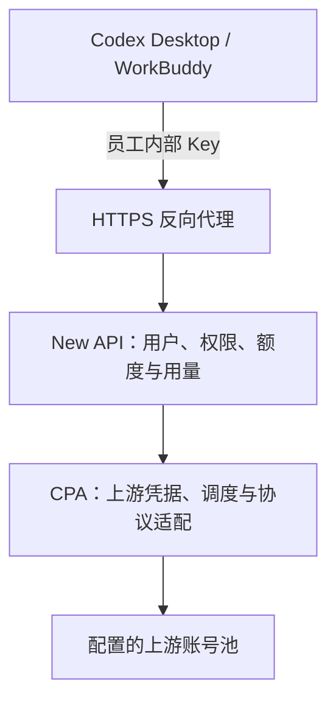

# 架构与职责

::: info 候选方案 · 端到端待验证
当前采用 New API + CPA 作为实现方向。是否保留两层取决于接入验证；不以增加层数证明更安全或更兼容。
:::

## 职责边界

| 层级 | 负责 | 需验证的边界 |
| --- | --- | --- |
| 客户端 | 员工交互、任务记录、工具执行及本地权限 | 自定义 Provider、工具能力、记录恢复 |
| 边缘反代 | TLS、入口路由、连接与请求限制 | SSE/WebSocket、长连接、取消传播 |
| New API | 用户、内部令牌、模型权限与用量归属 | 多层预算、精确结算、用途管理 |
| CPA | 上游认证、账号池、模型协议适配 | 账号刷新、粘性调度、失败恢复 |

## 数据与计费

New API 记录员工侧请求；CPA 账号侧记录是否能关联到同一个请求，需要验证请求 ID 传递及统计接口。Token 估算成本与订阅实际付款分开列示。

## 后续开发位置

组织、用途、预算、告警属于管理层扩展。协议和上游调度优先通过 CPA 已提供的功能配置，缺口再决定二次开发。所有管理凭据仅用于后台。
