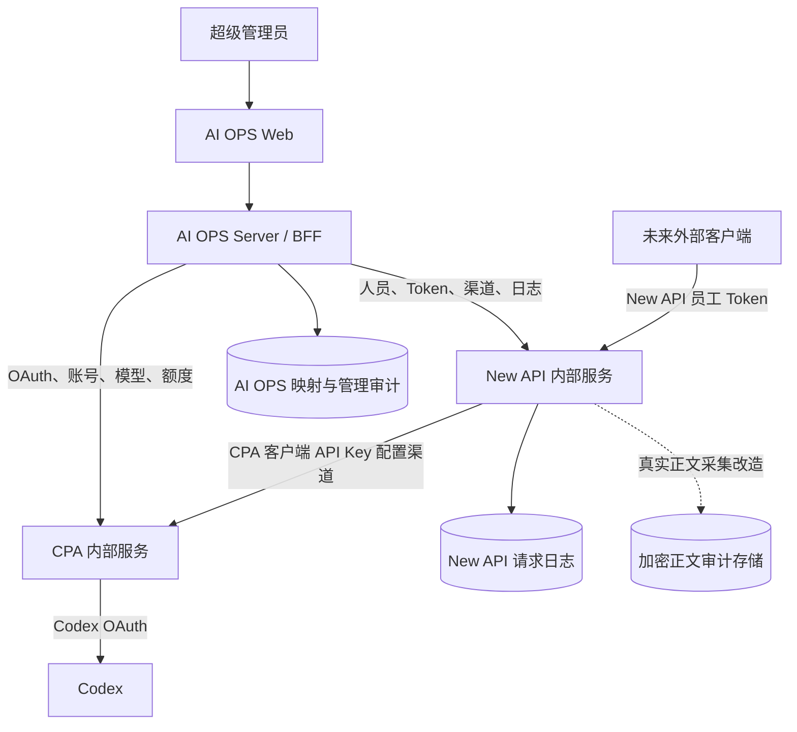

# 架构与职责

::: info 当前边界
AI OPS 是唯一的管理入口。CPA 和 New API 随根目录 Docker Compose 一起运行，作为内部依赖由 AI OPS 服务端适配器统一调用；管理员不需要打开、登录或配置它们的管理网站。
:::

## 运行与部署

- Docker Compose 一次启动 `web`、`server`、`new-api` 和 `cpa`，并通过 healthcheck 判断依赖是否可用。
- AI OPS 服务端使用 Compose 内部地址访问 New API/CPA；浏览器只访问 AI OPS 前端和 BFF，不直接请求上游管理 API。
- New API/CPA 的管理端口即使为本机调试保留，也不是业务入口，不应出现在 AI OPS 导航、iframe 或前端配置中。
- 启动后由 AI OPS 执行健康检查、版本识别、认证状态读取、模型目录刷新和 CPA 渠道校验；可安全修复的漂移使用幂等同步修复。
- 依赖状态至少分为 `starting`、`ready`、`degraded`、`auth_required` 和 `sync_failed`。状态不明确时不能显示“已连接”或使用演示数据。

## 职责边界

| 层级 | 负责 | 不负责 |
| --- | --- | --- |
| AI OPS Web | 超级管理员页面、人员/模型/Key/审计展示、操作反馈 | 保存上游管理令牌、直连 New API/CPA、实现第二套权限规则 |
| AI OPS Server/BFF | 统一鉴权、服务端适配器、幂等写入、状态聚合、映射和管理审计 | 生成本地可调用 Key、伪造额度、替代 New API 执行 Token 权限 |
| New API | 用户、员工 Token/API Key、单模型限制、无限额度/永不过期、渠道、请求转发和请求元数据 | 保存 CPA OAuth 原文、提供 AI OPS 管理页面 |
| CPA | Codex OAuth、认证文件、账号池、调度、模型目录、上游额度和协议适配 | 管理员工 Token、决定 New API Token 的人员绑定 |
| Codex | 上游模型调用和账号额度事实 | AI OPS 的人员、Key 和审计关系 |
| 正文采集层 | 在真实请求链路捕获 Prompt/工具调用/回复，关联 `token_id` 和 `request_id`，加密保存 | 重新鉴权、改变模型权限、另建额度或 Key |

## 凭据拓扑

项目中必须区分以下对象：

1. CPA Codex OAuth 认证账号：由 CPA 保存，用于访问 Codex。
2. CPA 客户端 API Key：由 CPA 提供给 New API 配置 CPA 渠道，只能在服务端使用。
3. New API 渠道：保存 CPA 地址和 CPA 客户端 API Key，负责将请求转给 CPA。
4. New API 用户 Token/API Key：由 AI OPS 调用 New API 创建并分发给员工，是唯一的员工接入凭据。

AI OPS 可以保存 New API `token_id`、掩码、人员映射和同步状态，但不能保存 CPA OAuth 原文、刷新令牌、CPA 客户端 Key 明文或员工 Key 明文。完整员工 Key 只在 New API 创建/重新生成成功后向超级管理员显示一次。

## 统一管理调用

所有管理动作由 AI OPS Server 通过适配器完成：

| 能力 | 目标服务 | 规则 |
| --- | --- | --- |
| 依赖健康/版本 | New API、CPA、Docker | 聚合真实状态、延迟、版本和错误原因 |
| 渠道同步 | New API + CPA | 使用 CPA 客户端 API Key，幂等创建/更新，不把渠道 Key 分发给员工 |
| 人员导入/停用 | New API | 创建/更新用户；停用时批量停用关联 New API Token |
| Key 管理 | New API | 一个 Token 只绑定一个人员和一个模型；默认无限额度、永不过期 |
| 模型目录 | CPA，再校验 New API 渠道 | 只展示 CPA 实际返回并能通过渠道转发的模型 |
| 额度/账号状态 | CPA | 通过当前 CPA 管理适配读取；不可读就显示未知 |
| 日志/审计 | New API + 正文采集层 | 以内部 `key_id`、`token_id`、`request_id` 关联 |

前端只调用 AI OPS 自己的统一接口。每个写操作带幂等键，记录上游响应摘要、版本、同步时间和错误；超时或部分成功进入可恢复状态，禁止由浏览器自行重复创建。

## 请求与审计路径

当前没有员工客户端。未来外部客户端使用 New API 员工 Token 直接请求 New API，New API 根据 Token 的单模型限制选择 CPA 渠道，再由 CPA 使用 Codex OAuth 调用 Codex。AI OPS 不在请求链路中复制一套员工鉴权或额度系统。

New API 当前普通日志主要能提供 Token、模型、时间、用量和状态等元数据，不能保证包含正文。因此，为满足“按 Key 查看真实 Prompt 和回复正文”，需要在 New API 请求处理边界补充正文采集：

- 在 New API 鉴权成功后取得 `token_id`，生成或透传稳定的 `request_id`；
- 捕获真实入站 Prompt、上下文、工具调用和真实出站回复；
- 拼接流式片段，保留失败、中断和已收到的正文状态；
- 正文与元数据分离并加密，普通日志只保存摘要、长度和哈希；
- 通过内部 `key_id`、`token_id` 和 `request_id` 回到 AI OPS 的审计页面；
- 正文最多保留 30 天，本版默认 30 天；查看、复制、导出和到期删除均记录管理审计。

以前未采集的历史请求不能根据 Token 数或请求 ID 还原正文，必须明确显示“无正文记录”。

## 故障与恢复

| 场景 | AI OPS 行为 |
| --- | --- |
| CPA 未启动或 OAuth 未完成 | 显示 `auth_required`/`degraded`，禁止创建依赖该模型的 Token，不使用模拟数据 |
| New API 未启动或管理认证失败 | 显示 `degraded`，禁止人员/Token 写操作，保留可重试状态 |
| 渠道缺失或配置漂移 | 服务端先执行幂等校验/同步；失败时显示渠道差异和错误，不重复创建 |
| 额度接口字段变化 | 适配器记录版本和原始错误摘要，页面显示“额度暂不可读” |
| Compose 重启 | 自动重新探测并恢复映射；恢复前显示 `starting`，不误报成功 |
| 部分批量停用失败 | 保留成功/失败 Key 清单，人员状态不显示为完全完成，允许安全重试 |

## 安全边界

- New API 管理凭据、CPA 管理 Key、OAuth 和数据库凭据只在服务端环境变量/挂载卷中使用。
- 浏览器不接收上游管理凭据，不通过前端直连、iframe 或后台链接绕过 AI OPS。
- AI OPS 不把 CPA 账号额度转换为人员额度；New API Token 的无限额度与 Codex 账号真实额度分别展示。
- 生产页面不读取旧 SQLite 演示人员、演示 Key、模拟调用或合成正文。
- 任何正文查看、复制、导出都只允许超级管理员，并记录目标 Key、`request_id`、时间、原因和范围。
