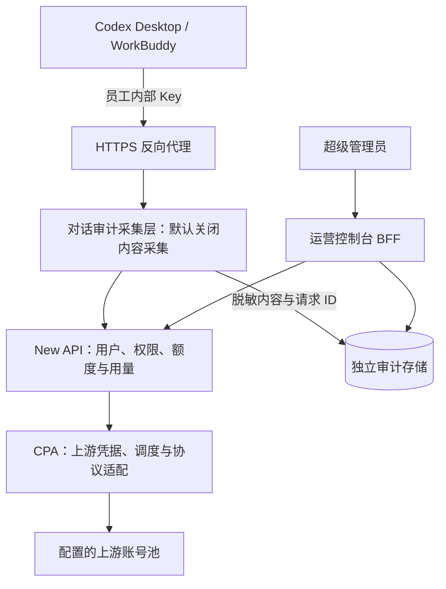

# 架构与职责

::: info 候选方案 · 端到端待验证
当前采用 New API + CPA 作为实现方向。是否保留两层取决于接入验证；不以增加层数证明更安全或更兼容。
:::

## 职责边界

| 层级 | 负责 | 需验证的边界 |
| --- | --- | --- |
| 客户端 | 员工交互、任务记录、工具执行及本地权限 | 自定义 Provider、工具能力、记录恢复 |
| 边缘反代 | TLS、入口路由、连接与请求限制 | SSE/WebSocket、长连接、取消传播 |
| 对话审计采集层 | 按策略采集请求与流式响应、脱敏、关联请求 ID | 会话归组、工具事件、性能与内容边界 |
| New API | 用户、内部令牌、模型权限与用量归属 | 多层预算、精确结算、用途管理 |
| CPA | 上游认证、账号池、模型协议适配 | 账号刷新、粘性调度、失败恢复 |
| 运营控制台 BFF | 校验管理权限，聚合用量与对话审计数据 | 不参与员工模型请求转发 |
| 独立审计存储 | 加密保存被允许采集的内容和访问记录 | 留存清理、密钥轮换、恢复验证 |

## 数据与计费

New API 记录员工侧请求；CPA 账号侧记录是否能关联到同一个请求，需要验证请求 ID 传递及统计接口。Token 估算成本与订阅实际付款分开列示。

New API 日志是调用索引，不作为完整对话来源。审计采集层必须在请求发生时保存允许留存的内容；以前未采集的历史请求不能根据 Token 数或请求 ID 还原。Chat Completions 可能重复携带历史消息，Responses 也可能只提供 `previous_response_id` 和当前输入，因此系统以“调用轮次”为基础保存，只有取得可靠会话标识时才合并为一段对话。

## 对话采集模式

| 模式 | 保存内容 | 默认权限 |
| --- | --- | --- |
| 仅元数据 | 人员、Key、模型、Token、费用、耗时、状态和请求 ID | 管理员可查 |
| 脱敏审计 | 当前轮输入、回答、工具调用摘要和脱敏结果 | 超级管理员 |
| 临时排障 | 限定请求 ID 的短期详细内容，自动到期 | 超级管理员临时开启 |

不提供全局无期限的原始对话记录开关。文件和图片默认只保存类型、大小和哈希；完整内容仅在另行审批的数据策略下处理。

## 后续开发位置

组织、用途、预算、告警属于管理层扩展。协议和上游调度优先通过 CPA 已提供的功能配置，缺口再决定二次开发。所有管理凭据仅用于后台。
