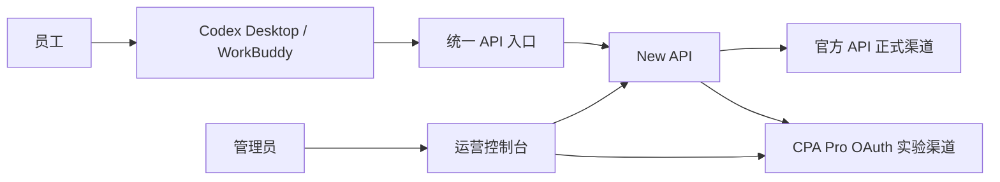

# 产品、技术栈与 UI 方案

::: info 文档定位
本页是从“本机试点”走向团队使用的产品方案，不是代码实现说明。状态分为“已决定”“建议”“待验证”和“二期”。
:::

## 1. 产品定位

平台解决四个问题：给每名运营人员发放独立 API Key；按人员、部门和业务用途分配模型与额度；让管理员能够看到用量、异常和上游账号状态；在明确授权和脱敏规则下审计指定业务对话。

一期先用 New API 和 CPA 的现有管理页面完成小范围验证。团队正式使用时，再增加一个统一运营控制台，把两个后台的关键数据集中展示。这样可以先验证真实链路，避免在上游协议尚未稳定前投入一套完整后台。

## 2. 分阶段产品形态

| 阶段 | 页面形态 | 能力边界 | 判定标准 |
| --- | --- | --- | --- |
| A 本机验证 | 文档中心 + New API + CPA 三个现有页面 | 验证 Key、模型、流式、工具调用、记录连续性和路由隔离 | 两个客户端完成测试清单 |
| B 团队试点 | 统一入口 + New API/CPA 现有页面 | 5–10 人、独立 Key、软额度、用量和指定 Key 的脱敏对话审计 | 连续运行两周，调用与审计数据可追溯 |
| C 运营版本 | 自建统一运营控制台 + 两个后台 | 组织、用途、预算、告警、对话审计和配置变更集中管理 | 管理员日常工作不需要反复切换后台 |

一期不开发模型转发内核，也不复制 New API 或 CPA 的账号管理逻辑。统一控制台只做聚合、权限和运营视图；真正的请求转发仍由 New API 和 CPA 负责。

## 3. 推荐技术栈

### 3.1 基础服务

| 层级 | 选择 | 用途 |
| --- | --- | --- |
| 员工 API 网关 | New API | 用户、Key、模型权限、渠道、用量和日志 |
| OAuth/协议适配 | CPA | Pro OAuth 实验账号、调度、会话粘性和协议转换 |
| 反向代理 | Caddy | 统一入口、TLS、请求体限制、长连接和访问日志脱敏 |
| 对话审计采集层 | 自建轻量服务 | 按 Key 策略采集请求与 SSE 响应、脱敏并关联 Request ID |
| 测试数据库 | SQLite | New API 原生支持；单文件、无需独立数据库服务，适合本机验证和低并发试点 |
| 审计存储 | 独立 SQLite 文件 | 仅保存获准采集的加密内容和访问审计，与 New API 数据分离 |
| 正式数据库 | MySQL 8.4 或 PostgreSQL | 团队长期运行、多机部署或并发写入增加后迁移 |
| 缓存 | 测试阶段不启用 Redis | 单机验证先减少组件；正式部署需要共享缓存或限流状态时再增加 |
| 文档站 | VitePress + Markdown | 项目说明、操作手册、验收记录和后台导航 |

New API 官方文档推荐 Docker Compose，并支持用户管理、Key 配额、模型限制、分组、用量看板和调用日志。[部署说明](https://github.com/QuantumNous/new-api/blob/main/README.md)；[功能说明](https://github.com/QuantumNous/new-api-docs-v1/blob/main/content/docs/en/guide/feature-guide/index.mdx)

### 3.2 统一运营控制台（二期或团队稳定后）

::: tip UI 技术栈已确定
统一运营控制台采用 [Tabler](/technical/ui-options) 视觉体系，保留 Vue 3 技术路线。界面使用 Tabler Core 和 Tabler Icons，图表统一使用 ECharts。
:::

| 层级 | 推荐选择 | 原因 |
| --- | --- | --- |
| 前端 | Vue 3 + TypeScript + Vite | 延续既定 Vue 技术路线，开发和部署简单 |
| UI 组件 | Tabler Core + Tabler Icons Vue | 提供高密度表格、表单、导航、状态和响应式布局 |
| 图表 | Apache ECharts | 避免依赖 Tabler 演示中的第三方图表库，统一用量和健康图表 |
| 状态管理 | Pinia | 管理登录态、筛选条件和服务状态缓存 |
| 服务端 BFF | Node.js 22 + TypeScript + Fastify | 聚合 New API 与 CPA，隐藏管理密钥，统一权限和审计 |
| BFF 校验 | Zod | 对第三方接口返回值做运行时校验，防止页面依赖不稳定字段 |
| 测试 | Vitest + Playwright | 分别覆盖数据转换和真实页面流程 |
| 构建部署 | Docker Compose | 与 New API、CPA 共用部署、备份和升级流程 |

浏览器不直接调用 CPA Management API，也不把管理密钥放入前端。浏览器只访问 BFF；BFF 在服务端保存两个后台的管理凭据，并将响应转换为平台自己的稳定数据结构。

统一控制台的普通运营数据仍优先读取 New API 和 CPA。新增对话审计后，需要独立审计存储：本机试点使用单独的 SQLite 文件，正文由应用层加密，密钥保存在数据库之外；正式多人部署时随主数据库方案迁移到 MySQL 或 PostgreSQL。调用日志与内容表分离，关闭内容采集不能影响正常用量统计。

### 3.3 数据库演进

本机验证和 5–10 人低并发试点使用 SQLite，持久化整个 New API `/data` 目录。SQLite 数据与 CPA 的 `config.yaml`、`auths/` 分开备份，因为上游 OAuth 状态不保存在 New API 数据库中。

出现以下任一情况后迁移到 MySQL 或 PostgreSQL：

- 进入长期在线的公司内网服务器。
- 多个 New API 实例需要共享数据库。
- 并发写入或日志查询出现明显锁等待。
- 需要集中备份、主从、高可用或外部审计工具。

迁移前必须在测试副本完成导出、导入、用户数、Key 数、渠道数、用量汇总和登录验证；确认回滚备份可用后再切换正式连接。

## 4. 核心数据和权限

### 人员

姓名、邮箱、部门、岗位、在职状态、月度成本点数目标、告警状态和最后使用时间。业务用途和模型归属于 Key，不作为人员档案字段；每个 Key 只绑定一个模型。

### Key

Key 名称、所属人员、用途、绑定模型（一个 Key 仅一个模型）、渠道分组、创建时间、过期时间、启用状态、最近使用时间。页面只显示脱敏 Key，完整 Key 只在创建成功时显示一次。

### 用量

请求数、输入 Token、输出 Token、总 Token、模型、状态码、延迟、成本点数和估算金额。官方 API 账单与 Pro 订阅使用量分开统计，不能合并成一张“实际账单”。

### 对话审计

审计记录包含请求 ID、可选会话 ID、人员、Key、模型、当前轮输入、模型输出、工具调用摘要、采集策略、脱敏状态、内容哈希和到期时间。输入输出正文加密存储，不保存认证 Header、完整 Key、OAuth Token或未经批准的原始文件。

### 对话访问审计

记录查看人、查看原因、查询条件、目标记录、查看/导出/删除动作、来源地址和时间。对话内容的访问日志不能由普通管理员删除。

### 权限角色

| 角色 | 可见范围 | 可执行操作 |
| --- | --- | --- |
| 超级管理员 | 全部人员、渠道、调用日志、脱敏对话和访问记录 | 系统配置、凭据配置、采集策略、对话查看与导出、备份和权限管理 |
| 管理员 | 试点人员、Key、用量、告警和调用元数据 | 创建/停用 Key、调整软目标、查看调用日志 |
| 员工 | 自己的 Key、模型和用量 | 查看个人信息和调用说明 |

员工永远不能看到官方 API Key、Pro OAuth 文件、CPA 管理密钥或其他员工的请求正文。

## 5. 最终页面信息架构

### 5.1 统一入口页

顶部显示平台名称、当前管理员、服务状态和文档入口。首屏显示四张卡片：

1. **运营总览**：今日请求、Token、成本点数、成功率、异常数。
2. **人员与 Key**：在职人数、启用 Key 数、即将过期 Key、达到 80% 的人员。
3. **上游账号**：官方渠道状态、CPA 实验账号状态、可用模型数量。
4. **待处理事项**：认证失败、流量突增、连续错误和待验证项目。

底部保留 New API 管理后台、CPA 管理后台和项目文档的快捷入口。链接只保存地址，不保存登录参数。

### 5.2 运营总览页

页面布局为“指标卡 + 趋势图 + 状态表”：

- 指标卡：今日请求、今日 Token、本月成本点数、成功率、P95 延迟。
- 趋势图：近 7/30 天请求量和成本点数。
- 分布图：按人员、部门、模型别名和渠道分布。
- 状态表：按 80%/100% 阈值排序，显示“正常 / 接近目标 / 已达目标 / 上游异常”。

一期的 80% 和 100% 只产生醒目标记，不阻断员工请求。

### 5.3 人员详情页

左侧显示姓名、部门、岗位和在职状态；右侧显示本月目标、已用点数、剩余比例、请求数、Token、成功率和最近调用时间。下方提供 Key 列表，每个 Key 显示自己的用途和绑定模型。

管理员可以停用人员、停用 Key、调整软目标和查看脱敏调用记录，但不能在员工页面直接查看完整凭据。需要切换模型时，在 Key 管理中创建绑定目标模型的新 Key。

### 5.4 Key 管理页

采用表格 + 抽屉表单：

| 列 | 内容 |
| --- | --- |
| 人员 | 姓名和部门 |
| 用途 | 文案、客服、翻译、分析或实验 |
| 模型 | 允许的模型别名 |
| 状态 | 启用、停用、即将过期、已过期 |
| 用量 | 本月点数和请求数 |
| 操作 | 查看、停用、轮换、复制连接说明 |

创建 Key 时要求填写人员、用途、一个绑定模型、过期时间和备注。同一人员需要多个模型时分别创建多个 Key；删除或轮换前必须二次确认，并写入操作审计。

### 5.5 模型与渠道页

以矩阵展示“模型别名 → 渠道 → 实际模型 → 是否允许自动重试”：

| 别名 | 默认渠道 | 用途 | 自动跨渠道重试 |
| --- | --- | --- | --- |
| `ecommerce-copy` | 官方 API | 商品文案 | 否 |
| `ecommerce-service` | 官方 API | 客服回复 | 否 |
| `ecommerce-translation` | 官方 API | 多语言翻译 | 否 |
| `ecommerce-analysis` | 官方 API | 销售与广告分析 | 否 |
| `ecommerce-pro-lab` | CPA | 隔离实验 | 否 |

禁止把实验渠道配置成正式模型的隐式备用渠道，避免官方渠道故障时意外消耗 Pro OAuth。

### 5.6 用量与日志页

支持按日期、人员、部门、模型、渠道、状态和请求 ID 筛选。列表只显示错误摘要和脱敏元数据；请求正文默认不展示。详情页展示请求时间、首 Token 延迟、总耗时、输入/输出 Token、成本点数和上游渠道。

### 5.7 对话审计页

对话审计与调用日志使用独立页面。左侧按人员、Key、用途、模型、日期、采集策略和请求 ID 筛选；右侧以轮次展示脱敏后的用户输入、模型回答和工具调用摘要。无法确认会话归属时显示“独立调用”，不得根据时间接近强行合并。

页面顶部持续显示采集范围、留存到期时间和脱敏状态。首次打开正文要求填写查看原因；复制、导出和删除使用二次确认，并产生不可由普通管理员删除的访问审计。普通管理员只能看到“是否已采集”状态，不能打开正文。

### 5.8 上游账号页

CPA 页面只给管理员使用，显示账号在线状态、认证有效期、5 小时/周窗口（如果上游提供）、最近错误、冷却状态和最后刷新时间。官方 API Key 只显示渠道名称和健康状态，不显示密钥内容。

### 5.9 员工自助页

员工登录后只看到：个人 Key 的脱敏信息、复制连接说明、允许的模型、当月用量趋势、剩余软目标和常见错误处理。页面不提供上游账号切换，也不显示其他人员数据。

## 6. 页面状态与交互规则

- 绿色：服务可用、用量在 80% 以下。
- 黄色：达到 80%，显示“接近月度目标”。
- 红色：达到 100%，显示“已达月度目标，当前仍按一期规则继续提供服务”。
- 灰色：未配置或尚未验证，不伪装成已支持。
- 实验渠道统一使用紫色标签，并在页面注明“Pro OAuth 隔离实验”。
- 所有破坏性操作使用确认抽屉；所有管理变更写入审计记录。
- 加载失败时显示具体服务、时间和重试按钮，不显示管理密钥或上游完整错误正文。

## 7. 实施顺序

1. 本机部署 New API、CPA 和 Caddy；New API 使用持久化 SQLite，暂不部署 MySQL、PostgreSQL 或 Redis，也不接入真实员工。
2. 在 New API 中创建官方渠道、模型别名和一个管理员测试 Key。
3. 在 CPA 中完成独立 Pro OAuth 实验账号登录，只开放 `ecommerce-pro-lab`。
4. 用 Codex Desktop 和 WorkBuddy 完成对话、流式、工具调用、MCP、取消和重启恢复测试。
5. 创建 5–10 名试点人员，核对 Key 隔离、模型限制、用量记录和 80%/100% 标记。
6. 为专用测试 Key 开启限时对话审计，验证 SSE 组装、工具事件、脱敏、加密、留存删除和访问审计。
7. 连续运行两周，记录失败率、延迟、上游刷新、记录连续性和备份还原结果。
8. 试点通过后再开发统一运营控制台；前端先只读聚合，确认接口稳定后再开放 Key、预算和审计策略写操作。
9. 从当前电脑迁移到长期在线的公司内网服务器，再配置 HTTPS、访问控制和定期备份。

## 8. 验收标准

- 管理员可以在一个入口找到 New API、CPA 和全部项目文档。
- 员工只能使用自己的 Key 和被授权的模型。
- 正式模型与 Pro 实验模型路由明确，不能自动跨渠道切换。
- 用量可以按人员、模型、渠道和日期查询，成本点数与 Token 同时可见。
- 80%/100% 状态准确显示，达到目标不影响一期请求。
- Codex Desktop 与 WorkBuddy 的对话记录、流式响应、长任务、工具调用和 MCP 完成验证。
- CPA 停止时正式渠道继续可用；官方渠道异常时不会消耗 Pro OAuth。
- 页面、日志、备份和前端资源中不存在完整 Key、OAuth Token或数据库密码。
- 新增统一控制台后，浏览器不直接持有 New API/CPA 管理密钥。
- 未开启审计的 Key 不保存正文；开启审计的 Key 能用请求 ID 关联调用日志和脱敏对话轮次。
- 普通管理员不能读取对话正文；超级管理员每次查看、导出和删除都留下访问记录。

## 9. 明确限制

代理层无法保证 Pro OAuth 账号零风控或零封禁风险。Pro OAuth 只应作为隔离实验资源，正式业务容量使用获得授权的官方 API。任何对外提供 API 的行为，都需要另外核对上游条款、公司信息安全要求和适用法规。

统一控制台也不能改变客户端自身的会话存储方式。如果某个客户端在切换 Provider 后主动创建新会话，平台只能把操作步骤和验证结果记录清楚，不能承诺跨 Provider 自动合并历史对话。
