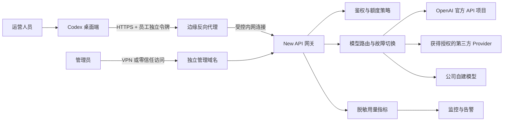

# Codex 桌面端反向代理安全架构方案

::: info 资料来源与验证状态
本页从历史交付文档整理。部署情况以[常用入口](/portal)的最新检查为准；业务功能描述属于需求或项目声明，未完成端到端验证。
:::


## 1. 目标与安全边界

Codex 桌面端通过公司控制的 HTTPS Provider 地址调用 AI。每名员工只持有独立的内部访问令牌，反向代理和 AI 网关负责鉴权、额度、限流、模型路由、用量统计及上游凭据管理。

本方案降低凭据泄露、越权调用、日志泄密和流量劫持风险，但不能承诺绝对零风险。生产环境不得依赖共享的 ChatGPT/Codex Pro OAuth、浏览器 Cookie 或个人订阅凭据；此类凭据集中反代仍存在账号限制、失效和上游服务条款风险。

## 2. 推荐架构



建议将调用入口与管理入口分离：

- `https://ai-api.example.com`：仅供 Codex 调用。
- `https://ai-admin.internal.example.com`：仅供管理员通过 VPN 或零信任网络访问。
- New API、数据库和上游凭据存储不得直接暴露到公网。

## 3. Codex 桌面端接入原则

1. 使用 Codex 支持的自定义 Provider/Base URL 指向公司网关。
2. 客户端令牌只代表员工身份和权限，不能是上游 API Key、OAuth Token 或管理员密钥。
3. 每位员工使用独立令牌，不允许多人共用一个令牌。
4. 令牌至少使用 256 位安全随机值；服务端保存不可逆摘要，明文只在签发时显示一次。
5. 给令牌配置人员、部门、用途、模型白名单、额度、有效期和状态。
6. 员工离职、设备遗失或异常调用时，应能在 60 秒内撤销令牌。
7. 不安装用于拦截 HTTPS 的自签名根证书，不关闭 TLS 校验，不修改 OpenAI 登录域名解析。
8. 反代不得注入或修改系统提示、工具定义和模型工具调用结果。

## 4. 反向代理安全基线

### 4.1 网络与 TLS

- 公网入口只开放 TCP 443，HTTP 端口只用于跳转或完全关闭。
- 使用可信 CA 签发的证书并自动续期，最低启用 TLS 1.2，优先 TLS 1.3。
- 网关服务仅监听内网地址；SQLite 数据目录不得通过静态文件服务暴露；正式阶段启用的数据库、Redis 和监控端口不得映射到公网。
- 管理后台与推理接口使用不同域名、路由和访问策略。
- 如有固定办公网络，可叠加 VPN、零信任接入或 IP 白名单。
- 只允许网关访问登记过的上游域名，禁止用户提交任意 Base URL，防止 SSRF。

### 4.2 接口与请求约束

- 调用域名只放行实际需要的接口，例如 `/v1/responses` 和必要的模型查询接口。
- `/api/*`、管理员接口、调试接口、数据库管理接口在调用域名上一律拒绝。
- 对请求体大小、Header 大小、并发数、RPM、TPM 和最长执行时间设置上限。
- 支持 SSE 流式响应，关闭代理缓冲和响应缓存，避免长任务内容被缓存到磁盘。
- 清理客户端传入的跳转头、代理头和不受信任的身份头。
- 网关自行生成上游 `Authorization`，不得把客户端令牌原样转发给上游。
- 仅信任来自指定边缘代理地址的 `X-Forwarded-For`，防止伪造来源 IP。
- 上游响应只回传业务需要的 Header，过滤 Cookie、内部地址和供应商诊断信息。

### 4.3 身份、权限和额度

- 每人一个账号和一个或多个用途令牌。
- 默认拒绝全部模型，再按岗位授予模型白名单。
- 同时执行人员、部门、用途、令牌和全局额度；任一硬额度达到上限即拒绝请求。
- 管理员账号启用 MFA，管理员令牌不得用于模型调用。
- 高权限操作记录操作者、时间、来源、对象和变更前后值。
- 令牌支持有效期、轮换、撤销和最后使用时间，建议每 90 天轮换。
- 对新设备、异常地域、流量突增、连续鉴权失败和大量 429/5xx 触发告警。

## 5. 上游凭据安全

生产环境优先使用公司拥有的官方 API 项目和服务账号。OpenAI 官方提供项目级服务账号及可设置有效期和作用域的 API Key，便于隔离环境和撤销凭据。

- 上游密钥只保存在服务端 Secret Manager、Vault、KMS 或受保护的容器 Secret 中。
- 不把上游密钥写入 Git、镜像、Docker Compose 文件、浏览器存储或客户端配置。
- 开发、测试和生产使用不同项目及密钥。
- New API 数据库中的敏感字段启用静态加密，备份同样加密。
- 限制只有网关运行身份能够读取上游密钥，后台普通管理员只能看到掩码。
- 上游密钥轮换后立即验证旧密钥失效。

### 禁止作为生产凭据的内容

- ChatGPT/Codex Pro 个人订阅 OAuth Token。
- 浏览器 Cookie、会话 Cookie 或登录缓存。
- 从员工电脑复制的 Codex 登录文件。
- 多人共享的官方 API Key。
- 来源不明的第三方中转密钥。

## 6. 日志与隐私

Codex 请求可能包含源代码、文件路径、终端输出、提示词和业务数据，因此反代默认只记录元数据。

允许记录：

- 请求 ID、员工 ID、部门、用途、模型别名。
- 时间、状态码、延迟、输入/输出 Token、估算费用。
- 路由渠道编号、错误分类、额度命中结果。

默认禁止记录：

- `Authorization`、Cookie、OAuth Token、上游 API Key。
- 完整提示词、完整回答、上传文件和源代码正文。
- 手机号、地址、订单信息及其他客户敏感数据。
- 包含请求体的 Debug 日志和异常堆栈。

如确需短期保存请求正文用于排障，必须由管理员临时开启、限定到单个请求 ID、自动到期并完成脱敏。日志设置最短业务必要留存期，并对导出行为审计。

## 7. New API 二次开发重点

| 模块 | 必须改造的内容 |
| --- | --- |
| 用户 | 增加部门、岗位、直属负责人、成本中心和在职状态 |
| 令牌 | 增加用途、设备备注、到期时间、模型白名单和硬额度 |
| 配额 | 增加公司、部门、人员、用途、令牌五级预算判定 |
| 路由 | 通过业务模型别名选择上游，不允许客户端直接指定渠道 |
| 日志 | 默认不存请求正文，所有凭据字段统一脱敏 |
| 告警 | 增加预算阈值、异常流量、错误率、余额和凭据到期告警 |
| 管理面 | 与调用域名隔离，接入 MFA、VPN/零信任和操作审计 |
| 凭据 | 增加外部 Secret Manager，避免数据库长期保存可直接使用的明文 |

## 8. 推荐请求链路

```text
Codex 桌面端
  → 使用员工内部令牌请求 https://ai-api.example.com/v1/responses
  → 边缘反代校验 TLS、路径、请求大小和基础速率
  → New API 校验令牌、人员状态、用途、模型和五级额度
  → New API 根据模型别名选择已授权上游渠道
  → 网关从 Secret Manager 读取上游凭据并发起请求
  → SSE 流式结果原样返回，不缓存响应正文
  → 只保存脱敏元数据、Token、费用、状态和延迟
```

## 9. 上线阻断条件

以下任一项未满足，不得让运营人员正式接入：

- 客户端需要保存上游 API Key、OAuth Token 或管理员密钥。
- 需要安装自签名根证书或关闭 TLS 校验。
- 推理域名能够访问管理员接口。
- 请求日志、错误日志或导出文件出现完整令牌、提示词或源代码。
- 不同员工能够使用或查看对方的令牌、额度、日志或请求内容。
- 令牌撤销后超过 60 秒仍可继续调用。
- 普通用户可以指定任意上游地址或绕过模型白名单。
- 生产环境依赖个人 Pro OAuth 或浏览器会话。
- 网关镜像使用浮动版本且没有回滚版本。
- 数据库和备份未加密或直接暴露到公网。

## 10. 安全验收测试

1. 为两个测试员工签发不同令牌，验证用量、额度和日志完全隔离。
2. 撤销员工 A 的令牌，验证 60 秒内所有新请求均返回鉴权失败。
3. 使用员工 A 的令牌请求未授权模型，验证请求在到达上游前被拒绝。
4. 构造伪造的 `X-Forwarded-For`、管理员 Header 和超大请求体，验证网关拒绝或覆盖。
5. 在请求中放入测试密钥标记，验证代理日志、New API 日志和监控系统均不出现该明文。
6. 检查 Codex 客户端和网关之间的连接证书，验证不存在 TLS 降级或中间人根证书。
7. 关闭主上游渠道，验证只切换到管理员配置的备用渠道并保留审计记录。
8. 达到人员或部门硬额度后，验证请求被拒绝且其他部门不受影响。
9. 验证流式响应、工具调用、长任务和取消请求均能正常工作，反代不修改响应事件。
10. 导出日志并扫描 `Authorization`、Cookie、Token 格式和测试敏感字段，结果必须为零。
11. 扫描镜像和依赖漏洞，验证没有未处置的严重及高危漏洞。
12. 从加密备份恢复到隔离环境，验证权限、额度和审计数据一致。

## 11. 推荐实施顺序

1. 使用官方 API 或获得授权的 Provider 完成最小链路。
2. 部署独立 HTTPS 调用域名和内网管理域名。
3. 完成人员独立令牌、模型白名单、硬额度和撤销机制。
4. 关闭请求正文日志，完成凭据统一脱敏。
5. 接入监控、成本报表及企业微信或钉钉告警。
6. 按安全验收测试逐项验证，通过后先开放 3 至 5 人试点。
7. 观察一周的错误率、费用偏差和异常调用，再逐步扩大人员范围。

## 12. 参考资料

- New API 渠道管理：<https://docs.newapi.pro/zh/docs/guide/feature-guide/admin/channel>
- OpenAI 项目服务账号 API：<https://developers.openai.com/api/reference/cli/resources/admin/subresources/organization/subresources/projects/subresources/service_accounts>
- OpenAI 服务账号 API Key：<https://developers.openai.com/api/reference/cli/resources/admin/subresources/organization/subresources/projects/subresources/service_accounts/subresources/api_keys/methods/create>

